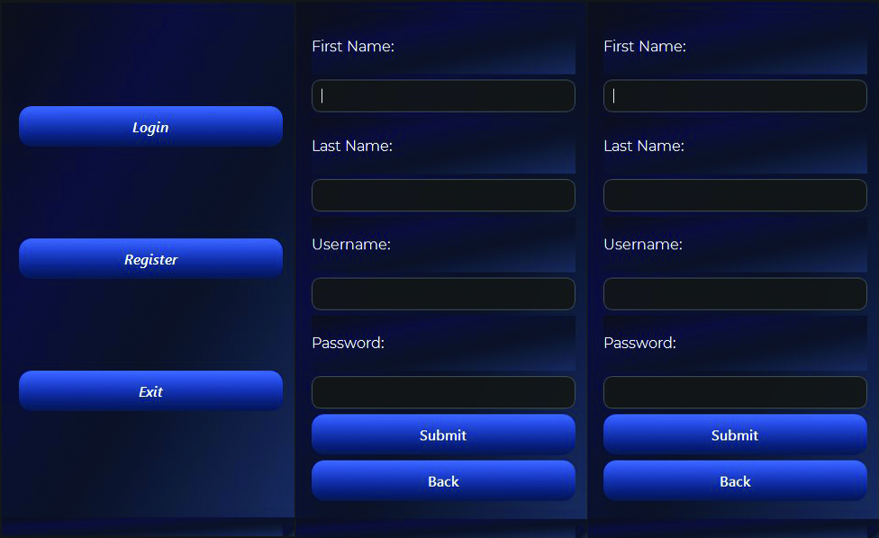

<h1>Login-System 1.0</h1>

<strong>Login-System 1.0</strong> is a simple and practical project designed to implement a basic login management system.  
The main purpose of this project is to practice and strengthen fundamental programming concepts such as:

<ul>
  <li>User management</li>
  <li>Input data validation</li>
  <li>Designing a simple user interface</li>
  <li>Storing user information</li>
  <li>Working with logical programming structures</li>
</ul>

<h2>Program Environment</h2>

Below is a preview of the program environment:

<h2>Save Users</h2>

This section demonstrates how user information is saved within the program:

